# Fusion 360 Tips, Tricks, and Good Practice

Fusion 360 has A LOT of features. Here’s a quick guide of tools and features to help get you started on your first project!

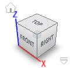

1.  Moving around
    -   **Hold down** the **mouse wheel** and **drag** to **move.**
    -   **Press** the **shift key** while **holding down** the **mouse wheel** to **rotate.**
    -   **Scroll** the **mouse wheel** to **zoom** in and out.
    -   **Click** to **select.**

    

2.  Changing the view of your workspace
    -   In the top right corner of the workspace there is a cube. **Click** on different faces, edges, or points to quickly see your design from different angles.
    -   At the bottom of the screen there’s a toolbar. **Click** the **Grids and Snaps** icon to change these features.
3.  Sketch dimensioning
    -   Dimension sketches such that they’re easy to read. They will likely need to be edited later.
    
    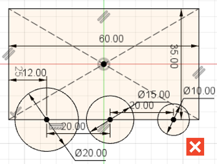
    
    -   Sketch lines will show up as blue or black, depending on how they’re dimensioned. Black lines are fully defined, meaning the line’s length and position has been completely described by dimensions. Blue lines are under-defined, meaning at least one dimension is missing. It’s best to have fully defined lines because they are controlled and cannot be accidentally moved.
    
    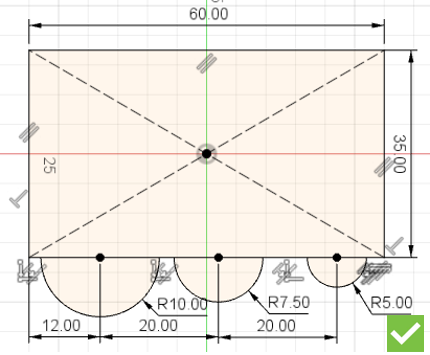
    
    -   The **Trim** tool 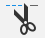 can be used to remove excess sketch lines. This keeps the sketch clean and makes extruding or revolving it easier.
4.  Common features
    -   **Extrude** 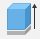 is used for moving a sketch in a straight line to create a 3D feature.
    -   **Revolve**  is used for rotating a sketch around an axis to create a 3D feature. Make round parts using a revolve instead of a series of extrudes. Then you only need to edit one sketch.
    -   **Hole** 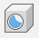 is a quick way to make several of the same hole type such as a clearance or threaded hole for a screw.
    -   **Fillet/Chamfer**   are tools used to modify the edges of a part. These features should only be used at the very end of designing a part. Otherwise, the wrong edges may be selected for dimensioning or errors may be caused.

    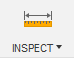

5.  Measuring
    -   Sometimes you may want to quickly view a dimension without going into a sketch. Above the **Inspect** menu, click on the **Measure** 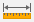 tool.
    -   **Click** on a surface, edge, or point. Geometric properties relating to that feature will appear.
    -   **Click** on a second surface, edge, or point. The distances between the two features will appear.

    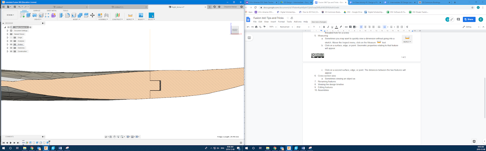

6.  Cross-section view
    -   Sometimes viewing an object through the middle of it is more useful than from the outside (e.g. in the bone-splitting activity, interlocking features are made). Viewing a cross-section is useful to ensure there is no interference between features.
    -   **Click** on the **Inspect** drop-down menu. Click on **Section Analysis. Click** on a plane that is parallel to the plane you want to view your object, then drag the cross-section plane to the area you want. Click **OK**.
    
    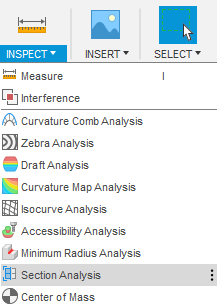
    
    -   To turn the feature on and off. Find the **Analysis** folder in the **Browser**. Click the eye next to the **Section** to turn its visibility on or off.
7.  Renaming features
    
    
    
    -   The design **Timeline** can quickly get messy, especially when designing parts with a lot of features. Renaming features helps to remind you of the feature’s purpose.
    
    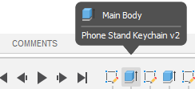
    
    -   **Right-click** on a feature, then click **Rename**. Type an appropriate name and hit the **Enter** key.
    -   Now when you hover your mouse over the feature in the **Timeline**, you will be able to see your custom name.
8.  Editing features
    -   A feature or sketch can be edited by **right-clicking** on it from the **Timeline**, then clicking **Edit Feature** or **Edit Sketch**. Dimensions and other parameters can then be changed.
    
    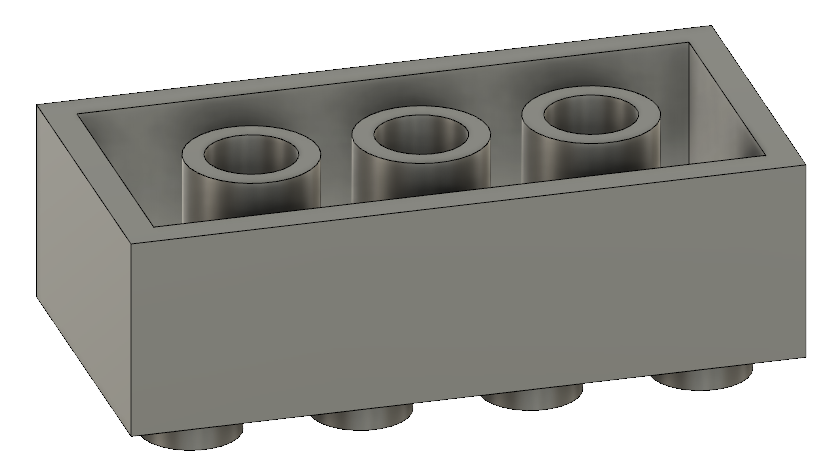
    
    -   After you make a part, you will almost certainly need to go back and edit various aspects of it. Often, editing time will exceed initial designing time. Consider the following questions when doing the initial design:
        -   What dimensions are the most likely to be modified?
        
        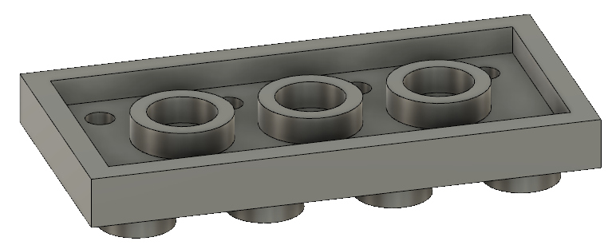
        
        -   If the outer dimensions of the part change, how do I want the other features to move with respect to the body?
        -   How should I setup a feature such that it changes (or doesn’t) when other features change. (e.g. in the Lego activity, it only takes one edit to change the Lego into a “short” Lego because one extrude depends on the length of another extrude).
    -   Sketches and features can be inserted into the middle of the **Timeline** by **dragging** this icon 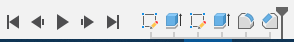 backwards in the **Timeline**. Continue with sketching and feature creation as usual. Then move it back to the end of the **Timeline**. This is desirable when the part has been “finished” with fillets and chamfers but it turns out another feature needs to be added.

[NEXT STEP: Design a Phone Stand](act-2.html){: .btn .btn-blue }
