# **Design a Phone Stand**

If you or your group have any questions or get stuck as you work through this in-class exercise, please ask the instructor for assistance.  Have fun!

1.  Download & install Fusion 360.
    -   Check your laptop specs to ensure it’s able to run Fusion 360: [https://autode.sk/2qg8ryB](https://autode.sk/2qg8ryB){:target="_blank"}
    -   Follow this link to make an Autodesk account and download Fusion 360: [https://autode.sk/3DW7TRB](https://autode.sk/3DW7TRB){:target="_blank"}
2.  Launch Fusion 360 and get familiar with how to move around.
    -   **Hold down** the **mouse wheel** and **drag** to **move.**
    -   **Press** the **shift key** while **holding down** the **mouse wheel** to **rotate.**
    -   **Scroll** the **mouse wheel** to **zoom** in and out.
    -   **Click** to **select.**
    -   **Press Esc** to **clear a selection**

    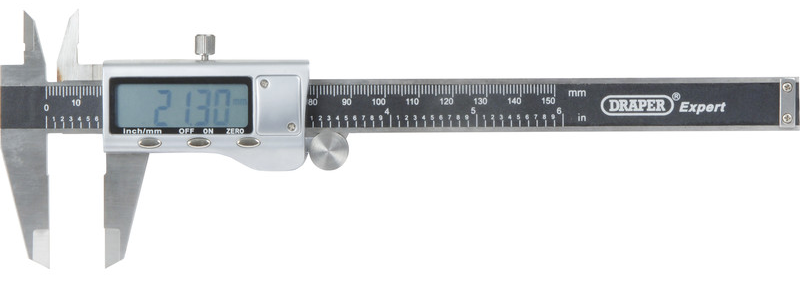

3.  Measure the width of your phone
    -   Ask the instructor for a caliper tool so that you can measure the width of your cell phone.
    -   **Write down or record the width** of your cell phone out to two decimal places
    -   Now **add 0.5 to the width** of your phone and write it down or record it (e.g. if my phone was **8.50mm** then I’d write **9.00mm**)

    

4.  Create the basic shape of the phone stand:
    -   Start a new sketch by **clicking** the **Create Sketch** icon . It will prompt you to select a plane. A good practice is to **select the plane** from which the object would be viewed in real life. In this case, the **top plane** or horizontal plane is desired because that is how the object will be 3D printed.
    
    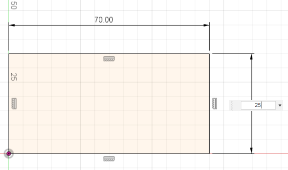
    
    -   **Select** the **2-Point Rectangle** tool . **Click** on the **origin** in the middle of the screen, then **click** somewhere above and to the right. Click the **Esc** key to exit the **2-Point Rectangle** tool.
    -   Try moving the sides of the rectangle around by **selecting** and **dragging** the **blue edges of the square.** The bottom and left sides can’t be moved because they’re defined by the origin. The top and right sides can be moved.
    -   Select the **Sketch Dimension** tool . **Click** on the **top line, move your mouse** slightly above the line and **click** again. **Enter 70 mm** as the dimension. **Repeat** with the **right line**, but enter **25 mm.**
    -   Notice that all sides of the rectangle are black. This means the sketch is fully defined.
    -   **Click** on the **SOLID** tab at the top of the screen. Click on the **Extrude** feature 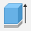. It will automatically select the interior area of the rectangle to extrude. Enter **2 mm** as the thickness. Then click **OK** in the **Extrude** pop-up box.
    -   Try rotating the part to view it in 3D by **holding down the shift key** and the **mouse wheel**.
    
    
    
5.  Cut out a slot for your phone and hole for your keychain.
    
    
    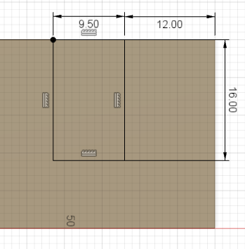
    
    -   **Click** on the **top face** of the object then **click** the **Create Sketch** tool .
    -   **Click** on the **2-Point Rectangle** tool. **Click** on the **top line** of the rectangle to constrain the first point of the rectangle to it and **click lower and to the right** of the first point.
    -   **Click** on the **Sketch Dimension** tool. **Click** on the **top line** of the new rectangle, **enter the value** you calculated in step **3c**. **Click** the **right line**, enter **16 mm**. Now hold down your shift button & **click** the **right side** of the new rectangle and the **right side** of the **old rectangle** and enter **12 mm**. Notice the rectangle is now fully defined and in the correct location.
    
    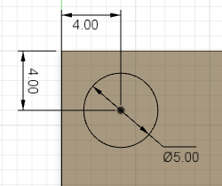
    
    -   **Click** on the **Center Diameter Circle** tool . **Click** on the part near the **top left corner**. **Click** again to **create a circle**.

        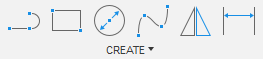
    
    -   **Click** on the **Sketch Dimension** tool. **Click** on the **circle** and enter **5 mm**. **Click** on the **center of the circle** and then **click on the left line** of the rectangle, enter **4 mm**. **Click** on the **center of the circle** and then **click** on the **top line of the rectangle**, enter **4 mm**.
    
    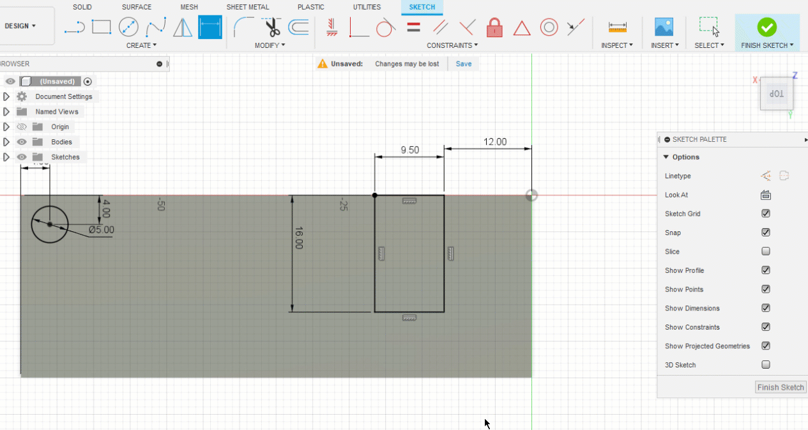
    
    -   **Click** on the **Create** drop-down menu. **Select Text** from the drop-down menu. **Click** at an open point **near the bottom right** of the large rectangle & then in open space on the top left (see below). **Enter** your desired parameters into the **Text** pop-up box. You may need to use the **Flip** commands to change the orientation of the text. You can drag the blue handle around to move your text. **Note:** 3D printers do better with bold text with minimal holes.
    -   **Right-click** on the **text**. Click **Explode Text**. Now your text should appear as lines.
    
    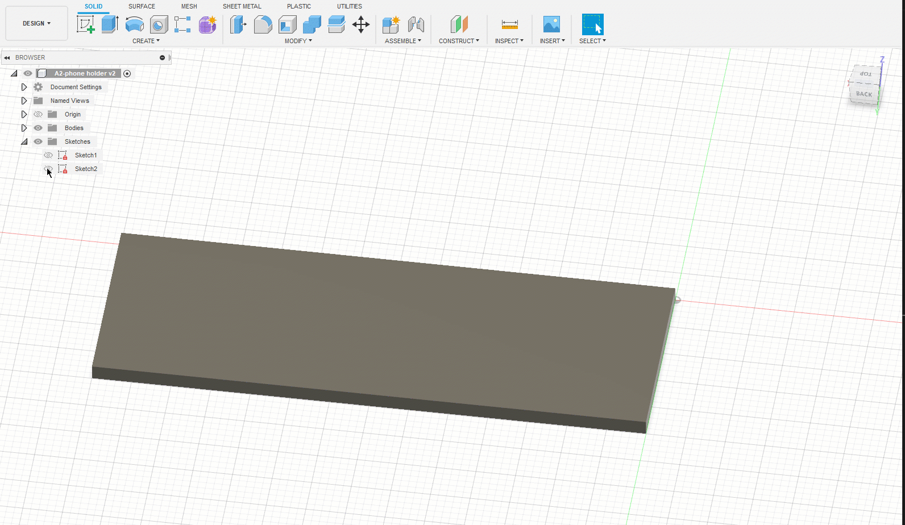
    
    -   **Click** the **SOLID** menu tab. **Click** on **Extrude** . Select the **faces to extrude** (circle, rectangle, and text features). **Rotate** the view of the part so it’s in 3D. In the **Extrude** pop-up box change the **Extent** to **All** and click **Flip**. The **Operation** should be **Cut. Click OK** (see images below for more details).

6.  Fillet and chamfer edges. **Note:** _Always leave fillets and chamfers to the end of the part._

    

    -   **Click** on the **Fillet** tool on the top menu . **Click** on the **6 outside vertical corner edges** of the rectangle in turn and **change** the **fillet radius** to **3 mm** for all of them.
    -   **Click** on the **Modify** drop-down menu. **Click** on **Chamfer**. **Click** on the **top edge** of the **hole** and the top edge for the outside profile. **Rotate around the keychain** and select the same edges on the **bottom**. **Enter** a **Distance** of **0.5 mm**, and press **Enter**.
    
    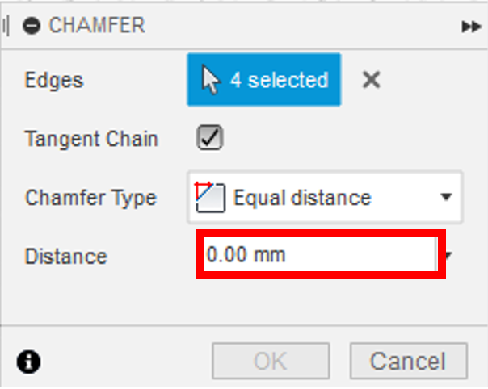
    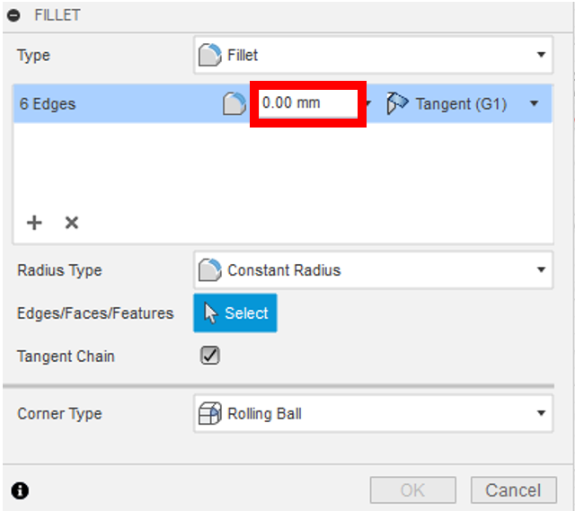
    
7.  Save by **clicking** the **Save** button on the top left of the screen. **Click** on **File**, then **Export**. Change the **Type** to the **.stl file format** and choose a location to save it, and select **Export.** It may take a couple of minutes to export. Congratulations! You can now 3D print your phone holder!
    
    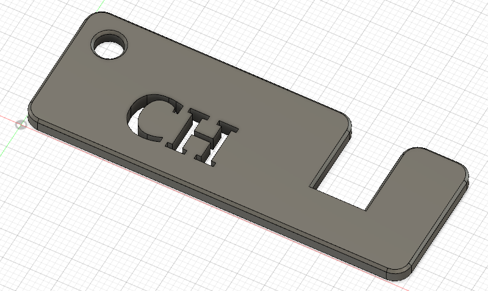
    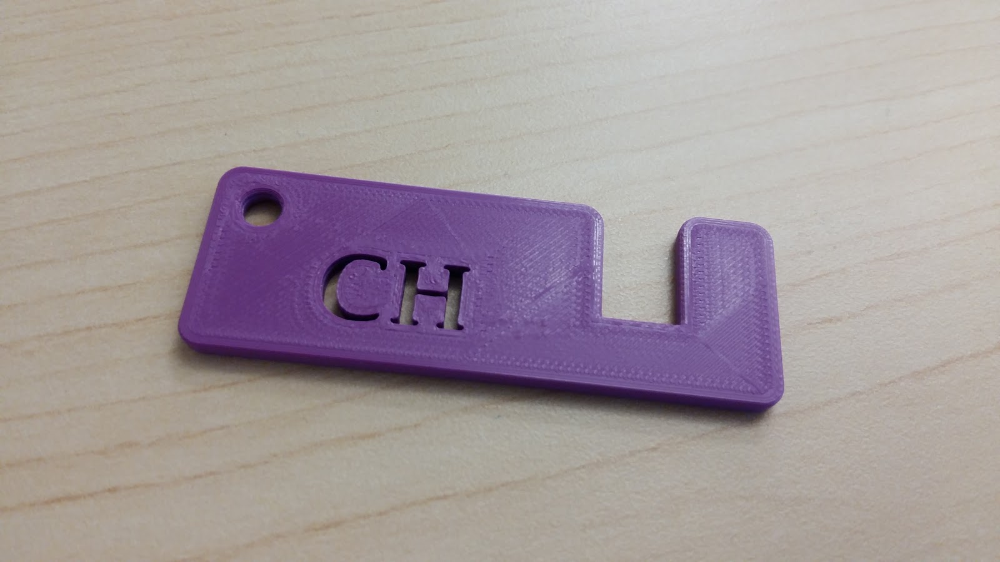

[NEXT STEP: Create a Lego Brick](act-3.html){: .btn .btn-blue }

