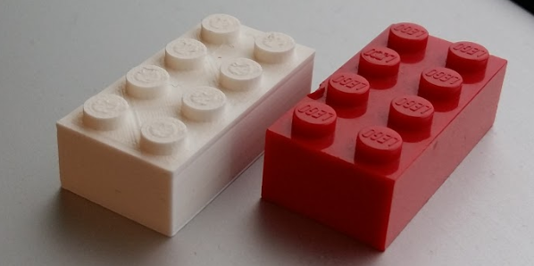

# Create a Lego Brick

If you or your group have any questions or get stuck as you work through this in-class exercise, please ask the instructor for assistance.  Have fun!
1.  **Download** and **install** Fusion 360:
    -   Check your laptop specs to ensure it’s able to run Fusion 360. System requirements are listed here: [https://autode.sk/2qg8ryB](https://autode.sk/2qg8ryB){:target="_blank"}
    -   Follow [this link](https://bit.ly/2QvZKeb){:target="_blank"} to make an Autodesk account and download Fusion 360.

    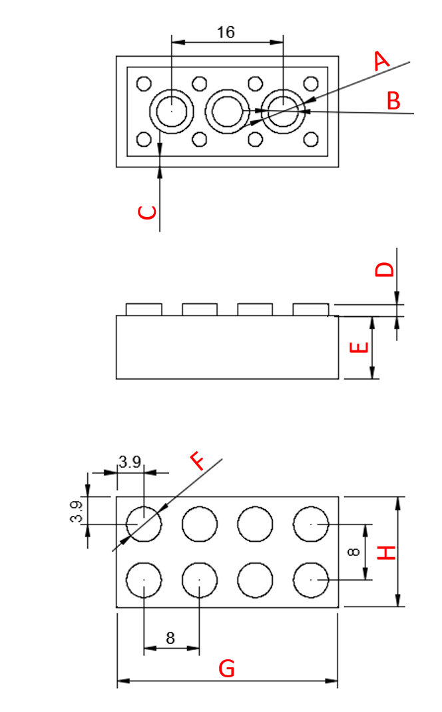

2.  Normally we’d measure the lego with calipers, but as we’re not in the library here are the dimensions you’ll need:
    -   A: 6.314 mm
    -   B: 5.314 mm
    -   C: 1.49 mm
    -   D: 1.7 mm
    -   E: 9.6 mm
    -   F: 5.0 mm
    -   G: 31.8 mm
    -   H: 15.8 mm
3.  **SKIP TO STEP 4!** Measure a Lego. Record the values below to two decimal places:

    For dimension **“C”**, include the thickness of the small nubs. Some of the dimensions are provided since they are a little more difficult to measure. But, they’re not impossible! How might you go about measuring them?
4.  Create a new part:
    -   **Open** Fusion 360
    
    
    
    -   **Click** on your **name** in the top-right of the screen, then **click** on **Preferences.**
    -   **Select** the **Design** (see above). Ensure **Auto project geometry on the active sketch plane** has a **checkmark** next to it. **Click OK.**
    -   On the top-right menu, **select File,** and then **New Design.**

    

5.  Make the main body:
    -   **Select** the **Create Sketch** feature . **Select** the **Top** plane.
    -   **Select** the **2-Point Rectangle**  tool. **Click** on the **origin,** then **click** somewhere **above and to the right. Click** the **Esc** key to exit the 2-Point Rectangle tool.
    
    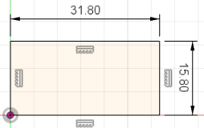
    
    -   Select the **Sketch Dimension** tool . **Click** on the **top line, move your mouse slightly** above the line and **click** again. **Enter** your measured **“G”** as the dimension. **Repeat** with the right line, but enter **“H”**.
    -   **Click** over to the **SOLID** tab on the top menu, and click on the **Extrude** feature . It will automatically select the interior area of the rectangle to extrude. Enter **“E”** as the thickness. Then click **OK** in the **Extrude** pop-up box.

    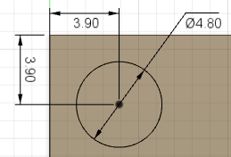

6.  Add connectors
    -   **Click** on the **top surface of the brick. Select** the **Create Sketch** button on the top menu.
    -   **Click** on the **Center Diameter Circle** tool . **Click** near the **top left corner** of the big rectangle. **Click** again to **create a circle.**
    
    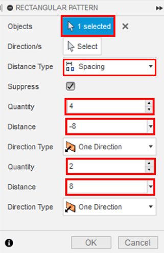
    
    -   **Click** on the **Sketch Dimension** tool. **Click** on the **circle** and enter the **“F”** value. **Click** on the **center of the circle** and then on the **left line of the rectangle, enter 3.9 mm. Click** on the **center of the circle** and then on the **top line** of the rectangle, **enter 3.9 mm. Click** the **Esc** key to exit the tool.
    -   **Click** on the **Create** drop-down menu. Click on the **Rectangular Pattern** tool . **Click** on the **circle.** Change the following to match the diagram to the right: **Distance Type, Quantities,** and **Distances.** Ensure the **Distance Type** is **Spacing. Click OK.**
    -   **Click** the **Solid** tab button. **Click** on the **Extrude** feature. **Select** the interior area of **all the circles. Enter** the **“D”** value as the thickness. Then **click OK** in the **Extrude** pop-up box.
7.  Hollow it out: Select the **Shell** feature 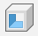. Select the bottom of the Lego brick. Enter **“C”** as the **Inside Thickness. Click OK.**

    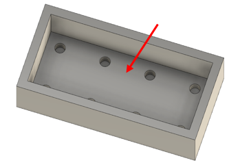

8.  Add circles to bottom:
    -   **Click** on the **bottom inside face. Click Create Sketch.**
    
    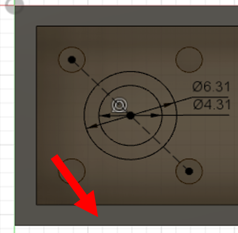
    
    -   In the **Sketch Palette,** on the far right, **click** the **Construction** icon . Then **select Line**  from the sketch tools on the top menu. Click the center of the top-left circle, then click the center of the circle diagonal to it. **Click** the **Esc** key to exit the Line tool. **Click** on the **Center Diameter Circle** tool. Hover over the middle of the line until a blue triangle appears. Click to place the center of a circle in the middle of the line, click again to make a circle. Repeat this once again, making this circle slightly smaller.
    -   **Click** on the **Sketch Dimension** tool. Click on one circle and enter **“A”.** Click on the other and enter **“B”.**
    
    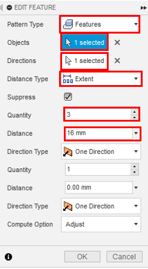
    
    -   **Click** over to the **Solid** tab. **Click** on the **Extrude** feature. Select the area between the two circles. Change the **Extent** to **To Object.** Select the space between the two outer rectangles (see where the second red arrow is pointing) as the **Object.** Then **click OK** in the **Extrude** pop-up box.
    -   **Click** on the **Create** drop-down menu. **Click** on **Pattern** to show a second menu. Select the **Rectangular Pattern.** Change the **Pattern Type** to **Features.** Select the newly-created cylinder. **Click** on the arrow next to **Directions. Click** on the **red axis** near the corner of the part. Enter **16 mm** as the **Distance.** Ensure **Quantity** is **3. Click OK.**
9.  Chamfer. Let’s add a small chamfer to specific edges to make 3D printing and assembly easier. Click on the **Modify** drop-down menu and select the **Chamfer** tool . Select all the edges highlighted in blue shown in the pictures. Enter **0.25 mm** as the **Distance. Click OK.**

    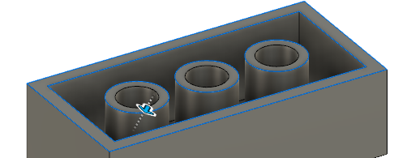
    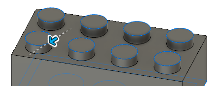

0.  Save using the **Save** button on the top left of the screen. **Click** on **File,** then **Export.** Change the **Type** to the **.stl** file format and choose a location to save it. It may take a couple of minutes to export. Congratulations! You can now 3D print a Lego!

     
    **OPTIONAL:** Optimize your lego piece for 3D printing so that supports are not necessary.

1.  Chamfer circle pieces on the bottom of the lego piece...
2.  Fillet internal corners underneath the lego piece...

[NEXT STEP: Create a Push Pin](act-4.html){: .btn .btn-blue }

