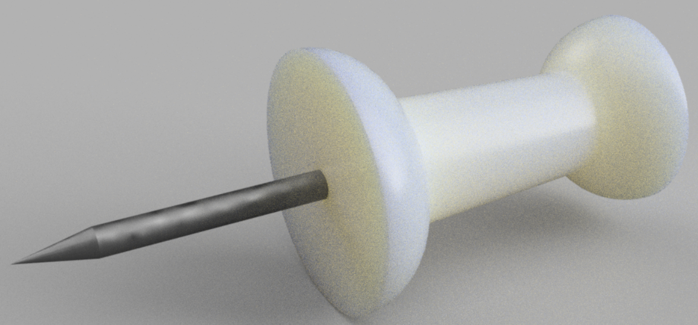

# **Create a Push Pin**

If you or your group have any questions or get stuck as you work through this in-class exercise, please ask the instructor for assistance.  Have fun!

1.  **Download** and **install** Fusion 360:
    -   Check your laptop specs to ensure it’s able to run Fusion 360. System requirements are listed here: [https://autode.sk/2qg8ryB](https://autode.sk/2qg8ryB])
    -   Follow this link to make an Autodesk account and download Fusion 360: [https://autode.sk/3DW7TRB](https://autode.sk/3DW7TRB)

    

2.  Create a new part:
    -   **Open Fusion 360**
    -   **Click** on your **name** in the top-right of the screen, then **click** on **Preferences.**
    
    
    -   On the top-right menu, **select File,** and then **New Design.**

3.  Make the plastic part of the push pin:
    -   **Select** the **Create Sketch**  feature. **Select** the **Top** plane.
    -   **Select** the **Line** tool . Make a “U” shape with lines by clicking on the green axis, then on the origin, then on the red axis, then straight up from that point. **Click** the **Esc** key to exit the Line tool.
    
    
    
    -   **Select** the **Sketch Dimension** tool . **Click** on the **right line, move your mouse slightly** to the left the line and **click** again. **Enter 4.5** as the dimension. **Repeat** with the other two lines and follow the dimensions in the picture to the right. **Click** the **Esc** key to exit the Sketch Dimension tool.
    
    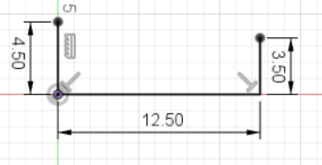
    
    -   **Click** on the **Center Diameter Circle** tool . First, **click** somewhere on the 4.5 mm line, then on the **endpoint** of the line. **Repeat** with the 3.5 mm line.
    -   **Select** the **Line** tool . **Click** on one **circle,** then **click** on the **second circle.**
    
    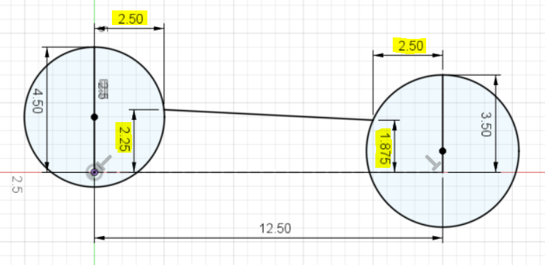
    
    -   **Select** the **Sketch Dimension** tool 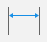. The 2.25 mm dimension can be added by hovering over where the line meets the circle until a point appears, clicking on the point, then clicking on the horizontal 12.5 mm line. Following the same method, add the dimensions highlighted in the picture above.
    
    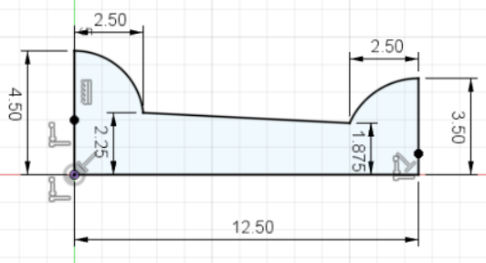
    
    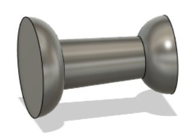
    
    -   **Select** the **Trim** tool 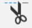. This tool allows you to remove sketch entities that are not needed. **Click and drag** over part of a circle, then **release** the mouse. **Delete** parts of the circles until it looks like the diagram to the right.

    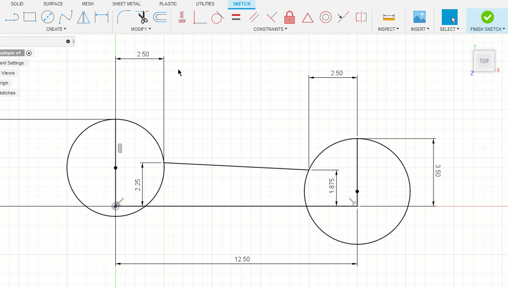

    -   **Click** over to the **SOLID** tab on the top menu, and click on the **Revolve** feature 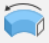. It will automatically select the interior area of the sketch to revolve. **Select** the 12.5 mm line as the **Axis. Click OK** in the **Revolve** pop-up box.
    
    
    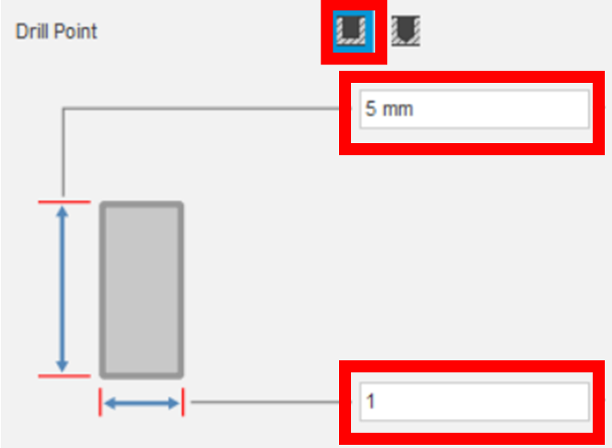

4.  Add a hole for the metal pin:
    -   **Click** on the **Left** face of the object. **Select** the **Hole** feature .
    -   **Drag** the hole so it’s snapped to the origin.
    -   In the Hole Feature window, change the **Drill Point** end condition to **Flat,** change the depth to 5 mm and the width to 1 mm.
    -   **Click OK** in the **Hole Feature** window.
  
    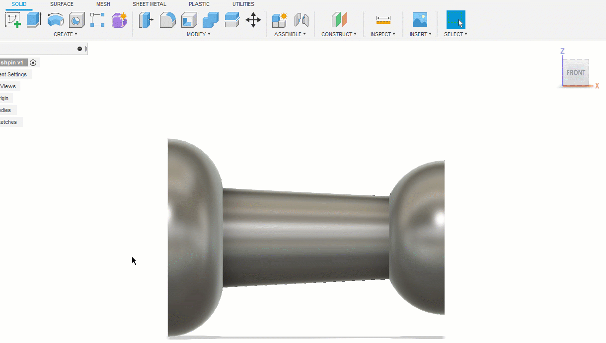

5.  Make it into a component:
    -   **Click** on the arrow next to **Bodies** in the **Browser.**
    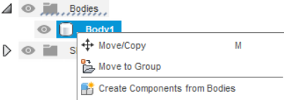
    -   **Right-Click** on **Body1** and select **Create Components from Bodies.** This has converted the pushpin body into a component. Components are the individual parts needed in an assembly, while bodies are just building blocks for components.
    -   Another way to make a component is to specify it before building any bodies. At the top of the screen, **click** on the **New Component** feature 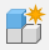. **Click OK** in the pop-up box.

    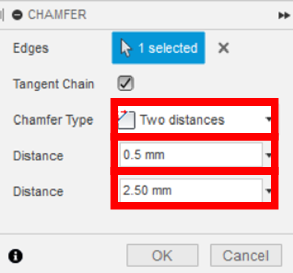

6.  Make the metal pin:
    -   **Orient** the push pin so you can look down the hole. **Select** the bottom face of the hole.
    -   **Click** on the **Extrude** feature . In the Extrude pop-up box, **enter 15 mm** as the **Distance.** Select **New Component** from the Operation drop-down. **Click OK.**
    -   **Click** on the **Modify** drop-down menu and select the **Chamfer** tool . **Select** the edge of the metal pin that isn’t in the plastic. Change the **Chamfer Type** to **Two distances,** change the first distance to 0.5 mm and the second to 2.5 mm.  **Click OK.**
    -   To activate both components at once, hover over the file name in the browser and **click the small circle** that appears next to the name. 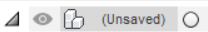

    
    
    **Congratulations! You have modelled an assembly of two components in Fusion!**

7.  **OPTIONAL:** Add appearances to the components of the push pin.
    -   **Click** on the **Modify** drop-down menu and select **Appearance.** Scroll down to the bottom of the window. 
    -   **Click** on the **Metal** folder, then on the **Steel** folder, drag the **Steel-Cast** block and drop it onto the pin. 
    -   **Click** on the **Plastic** folder, drag and drop the **ABS(White)** block onto the plastic part of the pushpin. If you want, you can try to make a render of the pushpin by clicking on **Design** in the top-left corner and selecting **Render.**
    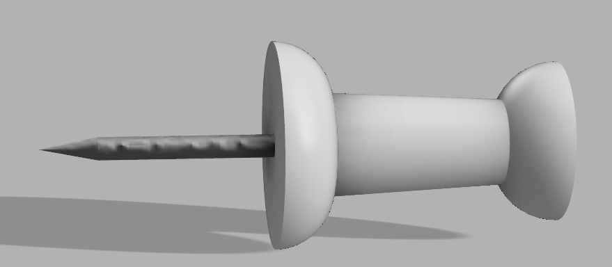

[NEXT STEP: Splitting an Object Found Online](act-5.html){: .btn .btn-blue }

