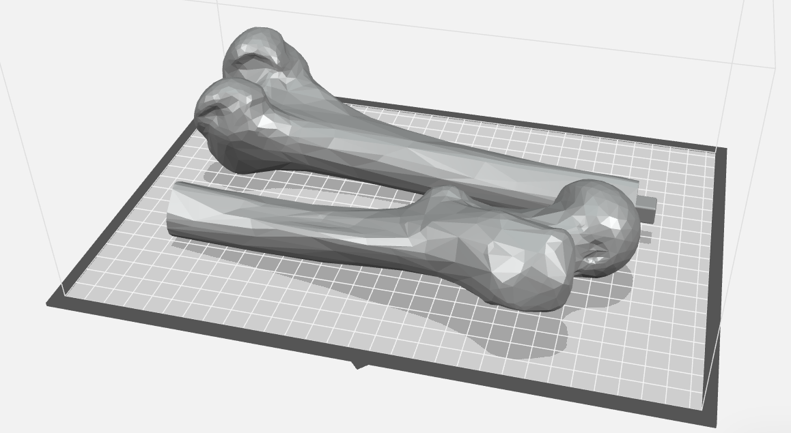

# **Split a Long Object in Fusion 360 (Part 1: Simple Split)**

If you or your group have any questions or get stuck as you work through this in-class exercise, please ask the instructor for assistance.  Have fun!

1.  Download and install Fusion 360.
    -   Check your laptop specs to ensure it’s able to run Fusion 360. System requirements are listed here: [https://autode.sk/2qg8ryB](https://autode.sk/2qg8ryB]){:target="_blank"}
    -   Follow this link: [https://autode.sk/3DW7TRB](https://autode.sk/3DW7TRB){:target="_blank"} to make an Autodesk account and download Fusion 360
2.  Launch Fusion 360 and get familiar with how to move around.
    -   **Hold down the mouse wheel** and **drag** to move.
    -   **Press** the **shift key** while **holding down the mouse wheel** to **rotate.**
    -   **Scroll** the **mouse wheel** to zoom in and out.
    -   **Click** to **select.**
    -   **Press Esc** to clear a selection.
3.  Download an STL file to split:
    -   **Download** the **Right_femur.stl** file from [here](http://bit.ly/35yi3nv){:target="_blank"}
    -   As you could guess from the description, a femur would be much too long to fit on our printers, so we need to split it into two parts.

    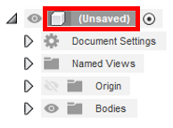

4.  Import Right_femur.stl file into Fusion 360:
    -   Open Fusion 360, it will automatically make a new part.
    -   **Right-click** on the **document name** “(Unsaved)”. At the bottom of the pop-up, **select Do Not Capture Design History.**
    -   **Click** on the **Insert** drop-down menu on the top navigation bar (see right) and **select Insert Mesh. Select** the **Right_femur.stl** file. **Click Open.**
    
    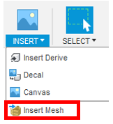
    
    -   In the **INSERT MESH** pop-up box on the right ensure the **Unit Type** is in **mm,** click on the **Center** button  (two places below Unit Type) and then **OK.**
    -   Now the model is a mesh body, but not a solid body that can be edited. **Click** on the **Mesh** tab at the top, then from the **Modify** drop down select **Convert Mesh**.  **Click** the femur body, then ensure ***Operation** is **Parametric** and **Method** is **Faceted**.
    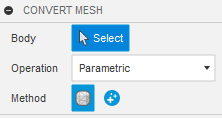
    -   **Right-click** on the **document name** again. At the bottom of the pop-up **select Capture Design History.** This allows you to go back and edit the features you create.

    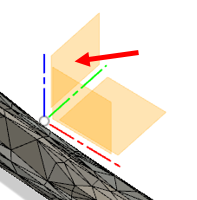

5.  Cut the bone into two pieces:
    -   **Click** on the **Construct** drop-down on the top menu and **select Offset Plane.** Select the YZ plane (see right). Enter a **Distance** of 5 mm, and **press OK.**
    -   **Click** on the **Modify** drop-down menu & **select** the **Split Body** tool .
    -   First, **click** on the **bone** to set it as the **Body to Split** (it will turn blue). **Click** on the **Select** button next to **Splitting Tool(s)** (see right). **Select** the **plane** you made, and a red disk will appear intersecting the bone. **Press OK.**
    
    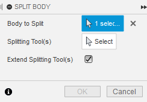
    
    -   **Note:** One of the original planes can also be used to split the part but often the original planes do not intersect the part where the separation is desired, so this method was used as a demonstration.
    -   **Note:** Notice that in the design tree there are now two bodies.
6.  Export as separate STL files:
    -   Right-click on **Body1** in the design tree. Select **Save As Mesh**.  Select .stl as the Format and  **Click OK** in the pop-up box. Save it in your desired location.
    
    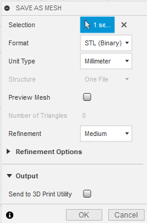
    
    -   Repeat with **Body 2.**
    -   Click on the **Save** button to save your Fusion 360 file.
    -   Congratulations! You now have a printable femur!

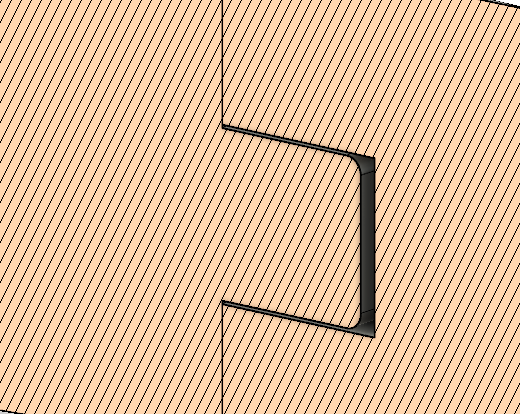

# **Split a Long Object in Fusion 360 (Part 2: Interlocking Features)**

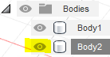

1.  Add a rectangular “peg” to one side of the femur:
    -   Hide **Body2** by going to the left panel and **clicking** the **eye** or **lightbulb** next to it on the design tree (see right).
    -   In the top right corner, **click** on the **Right** face of the view cube to rotate the bone. While in this view, **click** on the **cut face of the bone** and **click** on the **Create Sketch** tool .
    
    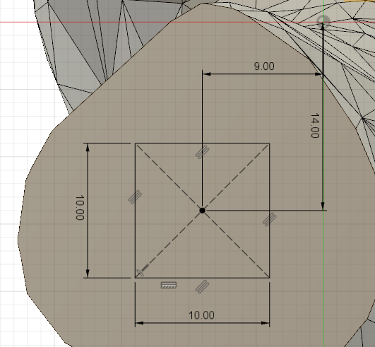
    
    -   **Click** on the **Create** drop-down menu, **click** on **Rectangle,** then **click** on **Center Rectangle. Click** somewhere **in the middle of the surface** and **click** again to **make the rectangle.**
    -   Select the **Sketch Dimension** tool . **Click** on the bottom line of the rectangle, then move the mouse down until a dimension is shown. **Enter 10 mm** as the value. **Repeat with the left line.** These dimensions can now be dragged closer to the rectangle to improve readability.
    -   **Click** on the **center** of the rectangle, then on the **origin** 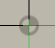 move your mouse above the part to create a horizontal dimension, click and enter 9 mm. Repeat in the vertical direction and enter 14 mm. **Click** on the green **Finish Sketch** button on the top right of the navigation bar.
    
    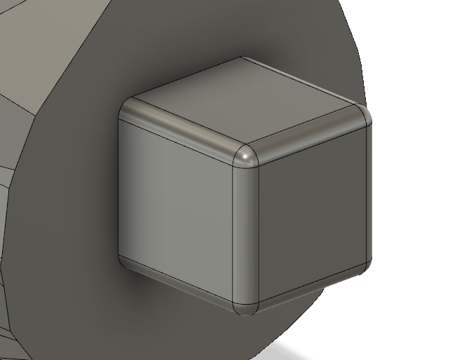
    
    -   Click over to the **Solid** tab and select the **Extrude** feature . Select the inside of the rectangle. Rotate the view so it can be viewed in 3D. Enter 10 mm and **click OK.**
    -   Click on the **Fillet** tool . Select the four edges of the square face and the four edges of the extrude. Enter 1mm as the **fillet radius** and **click ok.**

    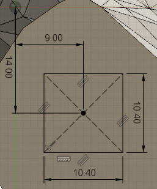

2.  Make a hole in the other side of the femur:
    -   Hide **Body1** by clicking the eye in the design tree and unhide **Body2.**
    -   In the top right corner, click on the **Left** face of the view cube. While in this view, click on the cut face of the bone and click on the **Create Sketch** tool.
    -   Make a sketch with dimensions in the picture to the right. Notice that it’s mirrored from the last sketch and that the rectangle is slightly bigger. When done, **Click** on the green **Finish Sketch** button on the top right of the navigation bar.
    -   Click over to the **Solid** tab and select the **Extrude** feature. Select the inside of the rectangle. Rotate the view so it can be seen in 3D. Enter -11 mm and **click OK.**
    -   Unhide **Body1** by clicking the eye again.

    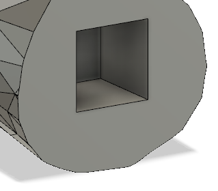

3.  Export as separate STL files:
    -   Right-click on **Body1** in the design tree. Select **Save As STL. Click OK** in the pop-up box. Save it in your desired location.
    -   Repeat with **Body 2.**
    -   **Click** on the **Save** button to save your Fusion 360 file.

**Congratulations! You now have a printable femur!**

[NEXT STEP: Earn a Workshop Badge](informal-credentials.html){: .btn .btn-blue }

