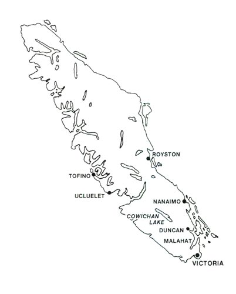
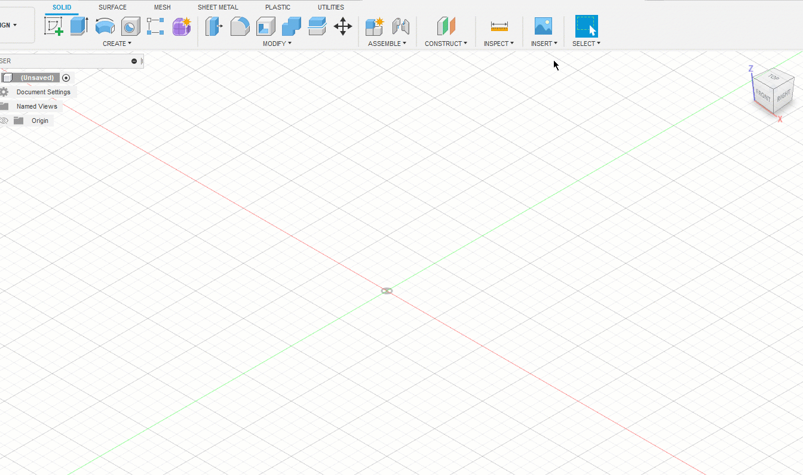

# **Create a Part from a Reference Image [UNDER CONSTRUCTION]**

If you or your group have any questions or get stuck as you work through this in-class exercise, please ask the instructor for assistance.  Have fun!

1.  Download and install Fusion 360.
    -   Check your laptop specs to ensure it’s able to run Fusion 360. System requirements are listed here: [https://autode.sk/2qg8ryB](https://autode.sk/2qg8ryB]){:target="_blank"}
    -   Follow this link: [https://autode.sk/3DW7TRB](https://autode.sk/3DW7TRB){:target="_blank"} to make an Autodesk account and download Fusion 360

2.  Download an image file:
    -   **Download** the **Vancouver Island** image file by clicking <a href="images/act-6/VanIsle.png" download>here</a>

3.  Launch Fusion 360 and get familiar with how to move around:
    -   Hold down the mouse wheel and drag to move.
    -   Press the shift key while holding down the mouse wheel to rotate.
    -   Scroll the mouse wheel to zoom in and out.
    -   Click to select.
    -   Press Esc to clear a selection.

4.  Import the image into Fusion 360:
    -   Open Fusion 360, it will automatically make a new part.
    -   **Click** on the **Insert** drop-down menu on the top navigation bar (see right) and **select Canvas. Select insert from my computer** and select your **image** file.
    -   **Click** the plane you want to put your image on (the top plane is best), then **click and drag** the box corners on top of the image to resize. For more exact sizing, you can input a scale factor into the box that appears. **Click ok** when you're happy with the size.
    
    

5. Trace the image:
    -   Make a new sketch.  **Click** the **sketch** icon then **click** on the same plane as your image.  
    -   **Click** on the **Fit Point Spline** tool 
    -   **Click** along the edges of the canvas to trace the outline.  Place as many points as you like - more points will give you a more accurate outline, but will take longer.  **Click esc** to exit the spline tool.
    -   **Click and drag** the black dots to adjust the position of each spline point, **click and drag** the green line to adjust the spline angle.
    -   Once you're happy with your outline, **Click the Solid tab** on the top left and **click** on the **Extrude** feature . Select your outline and set 5mm as the distance.

    

6.  Add a star marker:
    -   Hide your reference image to make sketching easier.  On the left sidebar, **click** the **eye** icon next to **Canvases**.  Note: _click the eye again to show the image._
    -   **Click** the **Create Sketch** feature to start a new sketch.  Select the top plane.
    -   **Select Polygon** from the create drop-down, then **click** on **Circumscribed Polygon**.  **Click** where you want the center of the polygon to go, then change the number of sides to 5.  **Click** anywhere to place your polygon, then **click esc**.
    -   Use the **dimension** tool to set one of the sides to 3mm.  
    -   **Select** the **line** tool under the create drop-down, then draw a star inside the pentagon.  
    -   Use the **trim** tool to remove extra lines.  Hold the **Shift** key and **click** on each side of the pentagon, then **Click** the **construction** option next to linetype in the sketch palette.
    -   From the **Solid** tab, **click extrude**.  Click inside your star sketch to select it, then choose Operation as Cut, and Extent Type as All.  Click OK.

    

7.  Export as STL file:
    -   Save by **clicking** the **Save** button on the top left of the screen. **Click** on **File**, then **Export**. Change the **Type** to the **.stl file format** and choose a location to save it, and select **Export.** It may take a couple of minutes to export. 

**Congratulations! You now have a printable model of Vancouver Island!**

[NEXT STEP: Earn a Workshop Badge](informal-credentials.html){: .btn .btn-blue }