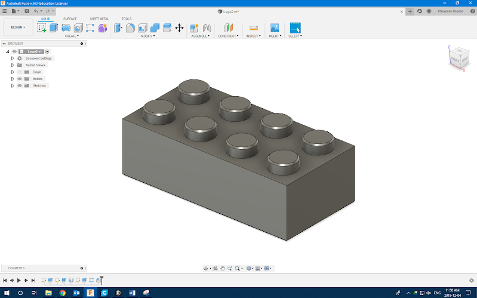

# Introduction to 3D Design With Fusion 360

- Pre-workshop activities: 20 min 
- Introductory presentation: 10 min
- Hands-on activities: 50 min

## Why Fusion 360

Fusion 360 is a powerful 3D Design software used by professionals and hobbyists.  Compared to beginner-friendly tools like TinkerCAD, Fusion 360 offers tools to design more complex 3D objects.  Fusion 360 is free for personal use, in contrast to most professional CAD software.
For more information on CAD software options, you can read a summary here: [13 Best CAD Software of 2022](https://www.adamenfroy.com/cad-software){:target="_blank"}

## Learning objectives

At the end of this workshop, you will be able to:

1.  Understand the limitations of intro CAD programs.
2.  Understand the limitations of 3D printing as a manufacturing method.
3.  Understand Fusion 360’s place in the world of CAD programs.
4.  Design an object using professional CAD processes including making sketches, dimensioning sketches, and applying features.
5.  Apply best practices while designing objects, including: defined sketches, clear dimensioning, design timeline organization and naming, and design for future editing.
6.  Measure an object accurately using calipers.
7.  Use measured dimensions to create a 3D model of an object.
 
[NEXT STEP: Pre-Workshop Activities](pre-workshop.html){: .btn .btn-blue }
